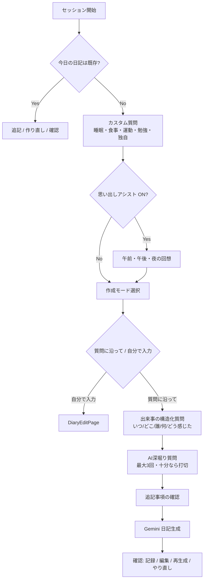

# ライフログ探偵 — プレゼンテーション資料

> 本資料は **2026年5月時点のソースコード** を根拠に作成しています。  
> `README.md` や `CLAUDE.md` に記載の「未実装」「匿名認証のみ」等の記述は、現行実装と乖離している箇所があります。

---

## スライド 1 — タイトル

# ライフログ探偵

**― 事件、受け付けます ―**

> AI探偵への「証言」だけで、日記（事件簿）が完成する Flutter アプリ

---

## スライド 2 — 一言で言うと

| 従来の日記 | ライフログ探偵 |
|-----------|---------------|
| 白紙に向かって能動的に書く | 探偵の質問に受動的に答える |
| 続かない・面倒・時間がない | 選択肢タップ・音声入力で手間を最小化 |
| 書いた後は振り返りにくい | 蓄積データをグラフ・AI所見で可視化 |

**コアバリュー：** 「書く」負担を「答える」体験に置き換える

---

## スライド 3 — 解決したい課題

### 日記が続かない3つの壁

1. **忘れる** — 夜になって「今日何したっけ…」
2. **面倒** — 空白のページに向き合う心理的コスト
3. **時間がない** — 長文を書く余裕がない

### アプローチ

```
能動的な「執筆」  →  受動的な「証言」
     ↓
探偵キャラクターが構造化された質問を投げかける
     ↓
Gemini が会話を「事件報告書」形式の日記に整形
```

---

## スライド 4 — 世界観・UXコンセプト

アプリ全体を **探偵事務所** のメタファーで統一。

| UI用語 | 実際の意味 |
|--------|-----------|
| 新規事件を開く | 今日の日記を作成 |
| 事件簿アーカイブ | 過去の日記一覧 |
| 証拠分析室 | 行動データの可視化・AI所見 |
| 探偵事務所 | 設定画面 |
| 証言 | ユーザーの回答 |
| 事件報告書 | 生成された日記本文 |

**ビジュアル：** マニラフォルダー風カード、セピア／ノワール／書斎の3テーマ、Playfair Display 系フォント

---

## スライド 5 — 主要機能（実装済み）

### 1. AIとの対話型日記作成
- 設定に応じた固定質問 → 出来事の構造化質問 → AI深堀り（最大3回）
- **選択肢ボタン**（2択以下）／**ドロップダウン**（3択以上）／**自由記述**／**音声入力**
- 「質問に沿って作成」または「自分で入力」の2モード

### 2. 事件簿（日記）の生成・保存
- Gemini 2.5 Flash が会話から日記テキストを生成
- 生成後：記録 / 編集 / 再生成 / 質問やり直し が可能
- 同日の追記・作り直しにも対応

### 3. 事件簿アーカイブ
- Firestore リアルタイム購読による一覧表示
- 日付順（新しい順）、プレビュー付きカード UI
- 詳細表示・手動編集

### 4. 証拠分析室
- 直近14日間のサマリー（平均睡眠・運動率・勉強率・連続記録日数）
- 睡眠時間バーチャート、感情・場所の分布パイチャート
- 活動記録テーブル（食事・運動・勉強・カスタム質問）
- **探偵の所見** — Gemini が過去の事件簿群を読み返して分析文を生成

### 5. 探偵事務所（設定）
- 記録項目の ON/OFF、カスタム質問、探偵キャラクター選択
- テーマ切替、通知時刻、CSV エクスポート
- Google ログイン / ゲスト利用 / ログアウト

### 6. 通知リマインダー
- 毎日指定時刻にローカル通知（「🔍 捜査の時間です」）

---

## スライド 6 — 日記作成フロー



---

## スライド 7 — 設計思想：ユーザーの負担を減らす

### 選択肢優先
- 睡眠時間は18段階のプリセット + カスタム入力
- 運動・勉強は「した / していない」の2択
- 出来事の「いつ」「どこ」「感情」もボタン選択が基本
- 「その他(自由記述)」で必要なときだけキーボード入力

### 思い出しアシスト
- 「今日何があった？」といきなり聞かず、**午前 → 午後 → 夜** と時間軸で回想を促す
- 一日の輪郭が浮かび上がってから、核心の出来事へ深堀り

### リアクション
- ボタン回答 → 探偵ロールごとの**固定リアクション**（API呼び出しなし）
- 自由記述 → Gemini が短い相槌を生成

### 逃げ道を用意
- 質問フローをスキップして **手入力** で事件簿を書ける
- 生成後も **編集ページ** で自由に修正可能
- **音声入力**（日本語、OS標準 STT）でタイピング負担を軽減

---

## スライド 8 — 探偵キャラクター（4種）

設定画面で切り替え可能。質問文・リアクション・日記文体・所見文体がロールごとに変化。

| キー | 表示名 | 特徴 |
|------|--------|------|
| `hardboiled` | ハードボイルド探偵 | デフォルト。寡黙でクールな捜査ログ文体 |
| `novice` | 新卒探偵 | 若手らしい口調 |
| `alien` | エイリアン | 地球の習慣を観察する視点 |
| `psychologist` | 心理学者 | 内面・感情に寄り添う口調 |

ロール定義は `lib/roles/` に静的に保持。UI 表示文面は Gemini 生成を待たず即時表示。

---

## スライド 9 — 画面構成

```
AuthGate
├── LoginPage          … Google / ゲスト / デモ（サンプル7日分投入）
└── HomePage           … 4つの事件ファイルカード
    ├── DiaryPage          … チャット形式の日記作成
    ├── DiaryListPage      … 事件簿アーカイブ（StreamBuilder）
    ├── AnalyticsPage      … 証拠分析室
    └── SettingsPage       … 探偵事務所

DiaryPage / DiaryListPage から
├── DiaryDetailPage    … 事件報告書の全文表示
└── DiaryEditPage      … 手動入力・編集
```

---

## スライド 10 — 技術スタック

| レイヤ | 採用技術 |
|--------|---------|
| フレームワーク | **Flutter**（Dart SDK ^3.11.1） |
| 認証 | **Firebase Auth** — Google Sign-In（7.x `authenticate` API）+ 匿名（ゲスト） |
| データベース | **Cloud Firestore** |
| AI | **Google Gemini 2.5 Flash**（`google_generative_ai`） |
| グラフ | **fl_chart**（棒グラフ・円グラフ） |
| 通知 | **flutter_local_notifications** + timezone |
| 音声入力 | **speech_to_text**（ja_JP） |
| テーマ永続化 | **shared_preferences** |
| エクスポート | **share_plus** + path_provider |
| 環境変数 | **flutter_dotenv**（`.env`） |

### 依存追加済み・未使用
- `table_calendar` — pubspec に含まれるが、現時点で UI には未組み込み

---

## スライド 11 — データモデル（Firestore）

```
users/{uid}/
├── settings/preferences
│     recordSleep, recordFood, recordExercise, recordStudy,
│     recallAssist, customQuestions[], selectedRole,
│     notificationEnabled, notificationHour, notificationMinute
│
├── entries/{YYYY-MM-DD}
│     diary: string
│     answers: { sleep, food, event_when, custom_0, ... }
│     numericAnswers: { sleep: 7.0, ... }
│     timestamp
│     └── conversation/{autoId}
│           role, text, order, timestamp
│
└── analyses/latest
      text, generatedAt, periodDays(14)
```

- 日付をドキュメント ID にすることで、日次エントリを自然にキーイング
- 会話履歴はサブコレクションに順序付きで保存（追記セッションにも対応）

---

## スライド 12 — AI の使い方（4つの役割分担）

| 用途 | モデル設定 | 出力形式 |
|------|-----------|---------|
| 深堀り質問 | インタビュアー人格 + JSON Schema | `{ sufficient, question }` |
| 自由記述リアクション | インタビュアー人格 | プレーンテキスト |
| 日記生成 | 日記ライター指示 + ロール文体 | 事件報告書テキスト |
| 所見生成 | アナリスト指示 + ロール文体 | 分析コメント |

**設計ポイント：**
- 固定 UI 文面はロール定義から同期取得（レイテンシゼロ）
- 深堀りは Gemini が「十分か」を判断。上限3回で打切
- 日記生成時、カスタム質問・思い出しアシストの回答は「含める/含めない」をユーザーが選択

---

## スライド 13 — 認証・アカウント

| 方式 | 用途 | 注意 |
|------|------|------|
| Google ログイン | 本番利用・端末間同期 | `.env` に `GOOGLE_WEB_CLIENT_ID` が必要 |
| ゲスト（匿名） | お試し | 端末固有。ログアウトでデータ再アクセス不可 |
| デモ | 即体験 | ゲストログイン + 直近7日分のモック事件簿を自動投入 |

`AuthGate` が `authStateChanges` を購読し、未ログイン時は `LoginPage`、ログイン済みは `HomePage` を表示。

---

## スライド 14 — 証拠分析室の中身

### 数値サマリー（直近14日）
- 平均睡眠時間 / 運動実施率 / 勉強実施率 / 連続記録日数

### グラフ
- **睡眠時間** — 日別バーチャート（0–12h）
- **感情分布** — `event_how` 回答の円グラフ
- **場所分布** — `event_where` 回答の円グラフ

### 活動記録テーブル
- 日付 × 食事 / 運動 / 勉強 / カスタム質問列

### 探偵の所見
- ボタン1つで Gemini が14日分の事件簿を読み返し、傾向・励ましを生成
- Firestore `analyses/latest` にキャッシュ（再推理も可能）

---

## スライド 15 — こだわった実装

### UX
- 探偵テーマの一貫したコピーライティング（「証言」「事件報告書 CLOSED バッジ」等）
- 3テーマ（探偵ライト / ノワールダーク / 書斎）を SharedPreferences で永続化、起動時チラつき防止
- 選択肢が多い質問はドロップダウン、少ない質問はボタンと UI を使い分け

### エンジニアリング
- ロールシステムでキャラクター追加を `lib/roles/*.dart` + レジストリ1行に集約
- Gemini 深堀りの終了判定を JSON 構造化出力に移行（文字列マッチ依存を排除）
- Firestore 会話保存と UI 表示を分離し、追記・やり直しフローに耐える状態管理

### デモ支援
- ログイン画面の「デモを見る」、設定画面（Debug）のモックデータ投入
- 日付を動的生成する7日分サンプルで、分析画面も即確認可能

---

## スライド 16 — README との差分（参考）

| 項目 | README の記載 | コード上の実態 |
|------|--------------|---------------|
| 認証 | Firebase Anonymous Auth のみ | **Google + 匿名** |
| 選択肢式 UI | 未実装 | **実装済み** |
| 証拠分析室 | 未実装 | **実装済み**（グラフ + AI所見） |
| 通知 | 未実装 | **実装済み** |
| カレンダービュー | 未実装（予定） | **未実装**（依存のみ追加） |
| AI深堀り | 1回 | **最大3回**（Gemini が打切判断） |
| 音声入力 | 記載なし | **実装済み** |
| 探偵キャラクター | 記載なし | **4種類実装** |
| テーマ | 記載なし | **3種類実装** |
| CSV エクスポート | 記載なし | **実装済み** |

---

## スライド 17 — 今後の展望（コードベースから読み取れる方向性）

### すぐ着手できそうなもの
- **カレンダービュー** — `table_calendar` は既に依存追加済み
- 分析期間の可変化（現在は14日固定）

### プロダクト拡張の方向性（`スライド発表.md` 等の意図と整合）
- 音声入力のさらなる活用（質問への直接音声回答など）
- ヘルスケア・生活習慣・自己分析への展開
- プリセット質問パック、ソーシャル機能（友達と競う等）
- ストアリリース

---

## スライド 18 — デモの流れ（発表用）

1. **ログイン画面** — 「デモを見る」でサンプル7日分を投入
2. **ホーム** — 4カードの世界観を説明
3. **新規事件を開く** — 選択肢回答 → AI深堀り → 日記生成 → 事件報告書確認
4. **事件簿アーカイブ** — 過去分の一覧・詳細
5. **証拠分析室** — グラフ確認 → 「探偵に推理させる」
6. **探偵事務所** — 記録項目・キャラクター・テーマ・通知のカスタマイズ

---

## スライド 19 — まとめ

### ライフログ探偵が提供するもの

> **「日記を書く」→「探偵に話す」** という体験の転換

- 受動的な回答だけで、読み返したくなる **事件報告書** が残る
- 睡眠・運動・食事など、**ライフログとして構造化** されたデータが蓄積される
- グラフと AI 所見で、**自分の行動パターンを客観視** できる

### 技術的な学び

- Flutter + Firebase + Gemini を組み合わせた **対話型コンテンツ生成アプリ** の実装例
- キャラクター（ロール）システムとプロンプト設計の分離
- 「続く日記」のための UX 設計（選択肢・回想・音声・手入力の逃げ道）

---

## 付録 A — プロジェクト構成

```
lib/
├── main.dart                    # 初期化: dotenv → 通知 → Firebase → テーマ
├── pages/
│   ├── auth_gate.dart           # 認証ゲート
│   ├── login_page.dart          # ログイン
│   ├── home_page.dart           # ホーム（4カード）
│   ├── diary_page.dart          # 日記作成（対話フロー本体）
│   ├── diary_edit_page.dart     # 手動入力・編集
│   ├── diary_list_page.dart     # アーカイブ一覧
│   ├── diary_detail_page.dart   # 日記詳細
│   ├── analytics_page.dart      # 証拠分析室
│   └── settings_page.dart       # 設定
├── services/
│   ├── auth_service.dart
│   ├── firestore_service.dart
│   ├── gemini_service.dart
│   ├── notification_service.dart
│   └── speech_service.dart
├── roles/                       # 探偵キャラクター定義
├── models/user_settings.dart
├── prompts/                     # Gemini プロンプトテンプレート
├── widgets/                     # MessageBubble, DiaryCard, InputArea
└── core/theme/                  # 3テーマ + ThemeController
```

---

## 付録 B — 必要な環境

```env
# .env（プロジェクトルート）
GEMINI_API_KEY=your_gemini_api_key_here
GOOGLE_WEB_CLIENT_ID=your_web_client_id.apps.googleusercontent.com
```

```bash
flutter pub get
flutter run
flutter analyze
flutter test
```

---

*資料生成日: 2026-05-30 / ソース: nikkinext リポジトリ lib/ 配下*
